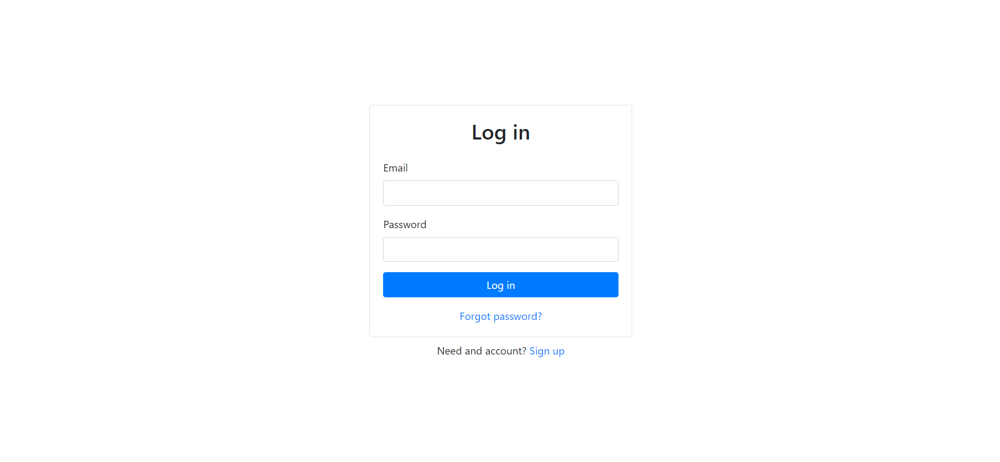
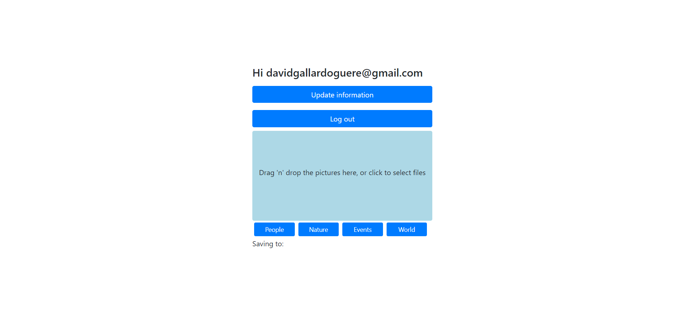

# Photography portfolio backend

This is the backend of of photography portfolio webpage

## Table Of Contents

- [Demo](#demo)
- [Getting Started](#getting-started)
  - [Prerequisites](#Prerequisites)
  - [Installation](#installation)
- [About the project](#about-the-project)
- [Technologies](#technologies)
- [Usage](#usage)
- [Roadmap](#roadmap)

## Demo




## Getting Started

### Prerequisites

To run the project you will need Node installed on your computer.

### Installation

- Save or clone the repository from https://github.com/DavidGuere/degg_API.

  - To save the zip file click on the "Code" button and then on "Download ZIP"
  - To clone the repository open the terminal in your desired directory and run the `git clone` command:
    ```sh
    git clone https://github.com/DavidGuere/degg_API.git
    ```

- Run the following code to install the necessary modules:
  ```sh
  npm install
  ```
- Run the `npm` command to run the project locally on your computer in development mode:

  ```
  npm start
  ```

## About the project

This is a full-stack web application. The application contains a small frontend which is designed using an MVC design pattern. The frontend is to authenticate the user using Firebase authentication and uses protected routes. The backend is designed using a layered structure. The backend saves the files to a AWS S3 bucket and to a Firebase Firestore database. It also resizes the images to save space in the cloud service.

## Technologies

- JavaScript: A high-level programming language.
- React: An open-source, front end, JavaScript library for building user interfaces or UI components.
- HTML: Hypertext Markup Language is the standard markup language for documents designed to be displayed in a web browser.
- CSS: A style sheet language used for describing the presentation of a document written in HTML.

- Java: object-oriented programming language.
- Firebase: a platform developed by Google for creating mobile and web applications.
- AWS: a subsidiary of Amazon providing on-demand cloud computing platforms and APIs.

## Usage

To use the application you must be authorized first. To request authorization contact the email in the second picture.

To save a picture just select a category from the options below and click or drag the images into the highlighted area.

## Roadmap

The backend reduces the quality of the images while performing the resizing. In the future, the resizing should be done without loss of quality.
